# Game Programming with Godot 4

---

## Scope

- Learn about Godot
- Make your first little physics game

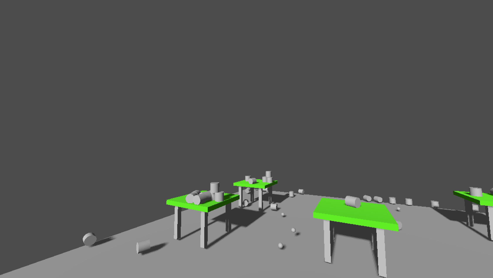

---

## Not Scope

- Sound
- Animation
- UI / Canvas
- Coding with C#

---

## Not Scope (2)

- Testing
- In depth 3D (materials, shaders, rendering pipelines, textures)
- Modeling using blender
- Networking / multiplayer / servers

---

## Part 1/3 - Introduction

- What is Godot? (10 min)
- Introduction to the Godot UI (10 min)
- Installing Godot (10min?)
- Exercise 1 - Make your first scene (30min)

---

## Part 2/3 - Physics in Godot

- Staticbody, Rigidbody (5 min)
- Exercise 2 - Add physics to your scene (15min)

---

## Part 3/3 - Scripting/Programming in Godot

- Introduction to GDScript

---

# What is Godot?

---

## What is Godot?

Godot is a Game Programming Engine - inspired by Unity and Unreal Engine.

---

## Godot is OSS!

Godot is free and Open Source (MIT).

---

## What is Godot? (3)

Godot can target natively:

- Linux (X11)
- Windows (UWP / Desktop)
- MacOSX

- Android
- iOS

- Web (HTML5/Webasm)

---

## What is Godot? (4)

Main Programming languages:

- GDScript (inspired by python)
- C#

---

# Installing Godot 4.x

---

## Installing Godot 4.x

Ubuntu/Debian:

```
sudo apt install snapd

sudo snap install core

sudo snap install godot-4 --edge
```

https://godotengine.org/download/linux/

---

# Exercise 1 - Create your first scene!

Let's learn by doing!

---

## Create a project


---

## Create your first Scene

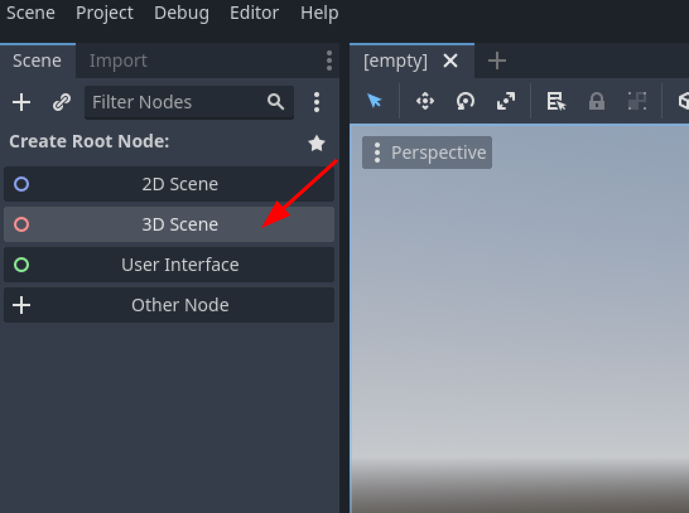

---

## Name the root node

Name is something like `World`.

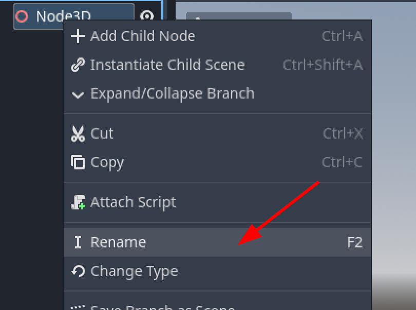

---

## Create floor

Add a `CSGBox3D` node to your world.

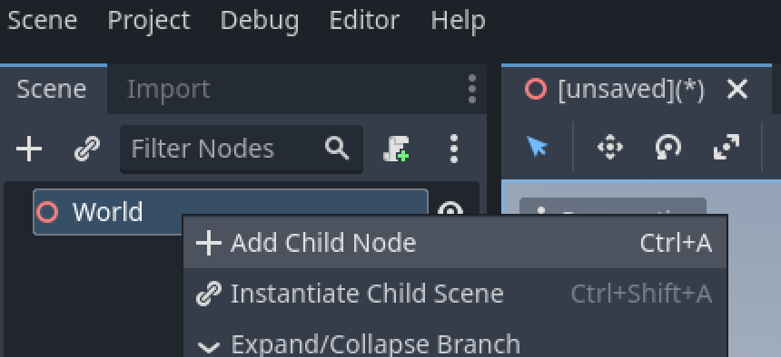

Name it `Floor`.

---

## Change size of cube

Change the size of the cube to make a floor tile

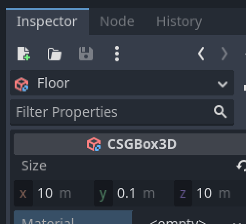

---

## Add material to the floor

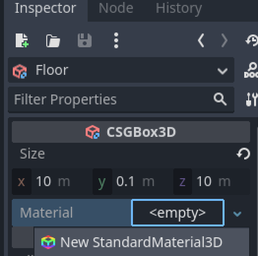

---

## Change the albedo of the floor

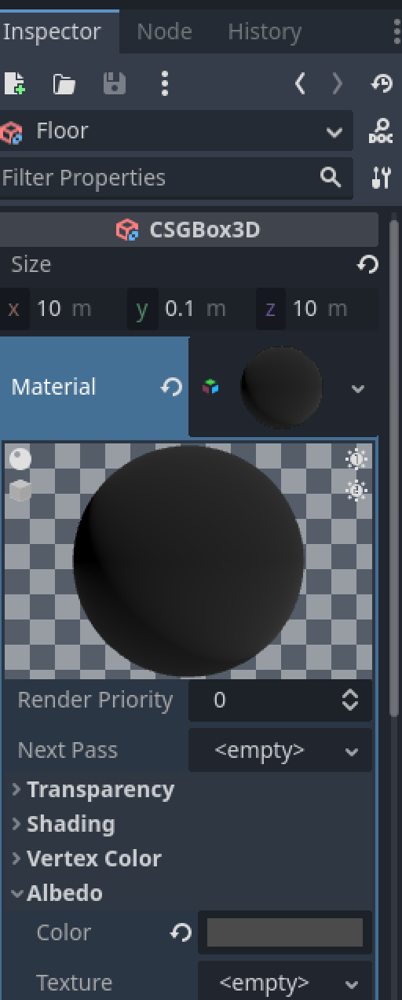

Trivia: Albedo is "Rückstrahlvermögen"

---

## Add a camera

Add a `Camera3D` node to your scene.

Use the handles to move the camera a bit upwards and rotate it downwards.

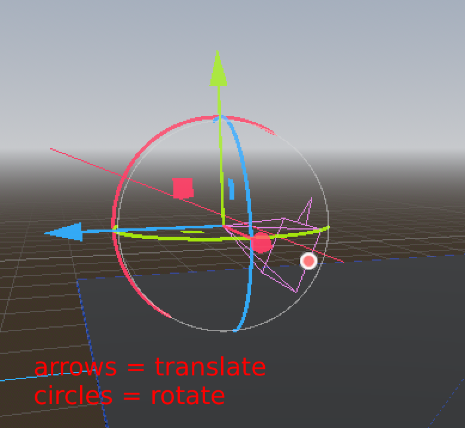

---

## Tip: Use preview and other perspectives!

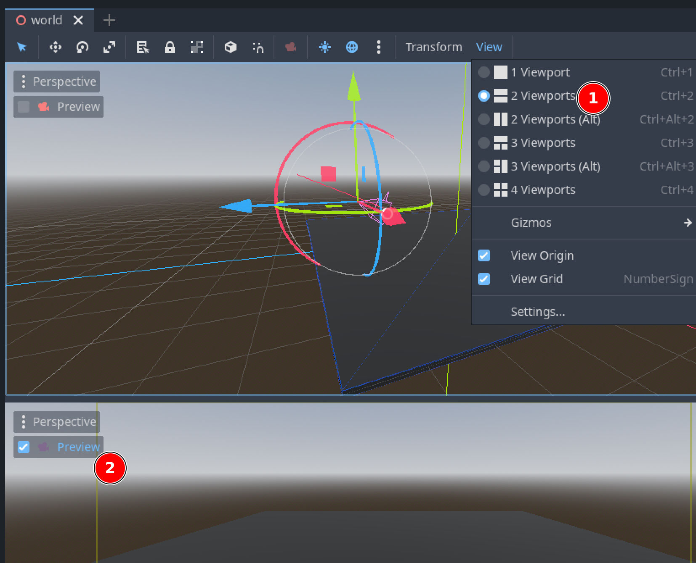

---

## Add a light

Add a `DirectionalLight3D` node to your scene.

1. Use the handles to control the direction of the light.
2. Make the light cast shadows

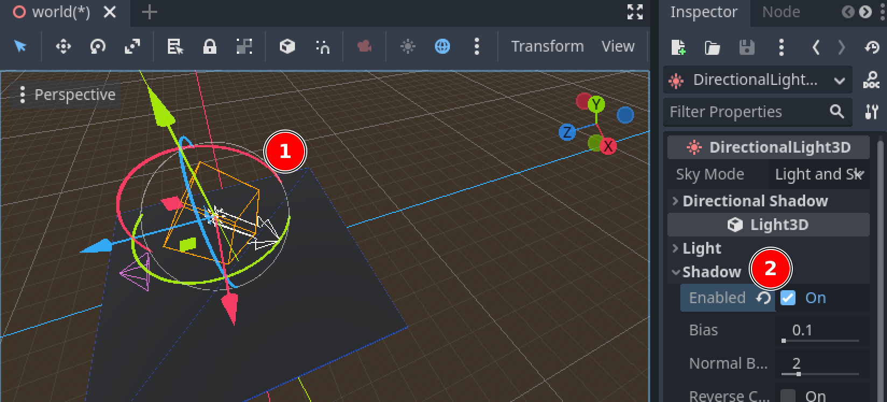

---

## Add a can

1. Add a `CSGCylinder3D` node to your scene.
2. Name it `Can`.
3. Resize it to 0.1m radius, 0.2m height
4. Change the material of your can
5. Press F5 to play your scene!

---

## Add a mouse look to your scene

Create a new script:

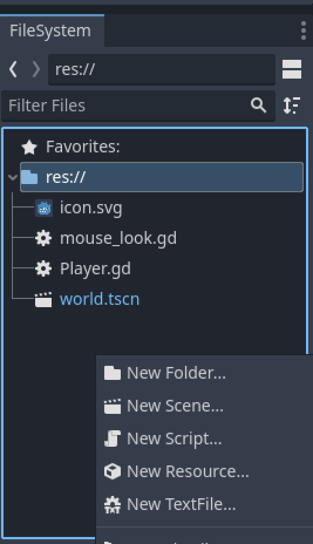

---

## Paste this code

```gdscript
class_name MouseLook

extends Node

## Target Node3D moved by the mouse. Most likely a Camera3D or parent of it. Defaults to parent.
@export var target: Node3D

## Higher means higher movements
@export var _sensivity: float = 0.25

var _total_pitch = 0.0

func _enter_tree():
	if (target == null):
		target = $".."

func _input(event: InputEvent):
	if target == null:
		return

	if event is InputEventMouseButton:
		var mouseEvent = event as InputEventMouseButton
		if mouseEvent.button_index == MOUSE_BUTTON_RIGHT:
			if mouseEvent.is_pressed():
				Input.mouse_mode = Input.MOUSE_MODE_CAPTURED
			else:
				Input.mouse_mode = Input.MOUSE_MODE_VISIBLE
				
	if event is InputEventMouseMotion and Input.get_mouse_mode() == Input.MOUSE_MODE_CAPTURED:
		var mouseEvent = event as InputEventMouseMotion
		var movement = mouseEvent.relative * _sensivity
		
		var yaw = movement.x
		var pitch = movement.y

		# Prevents looking up/down too far
		pitch = clamp(pitch, -90 - _total_pitch, 90 - _total_pitch)
		_total_pitch += pitch
	
		target.rotate_y(deg_to_rad(-yaw))
		target.rotate_object_local(Vector3.RIGHT, deg_to_rad(-pitch))
```

---

## Add MouseLook component to your camera

* Add child node to your camera
* Select MouseLook

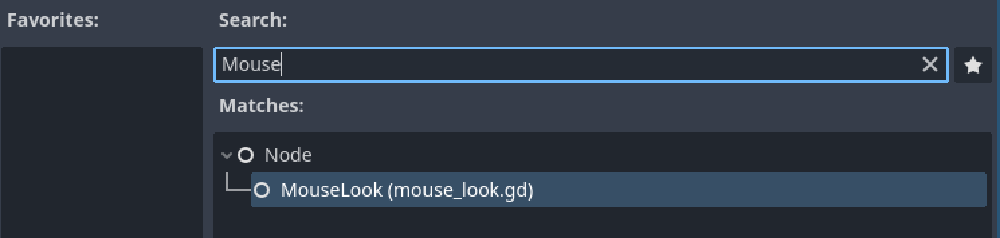

* Press `F5` to run your "game".
* Try looking around by holding right click

---

## Congrats! You have your first scene!

You've earned yourself a break!

---

# Physics in Godot

---

## Static body

Static bodies are not affected by other forces (gravity, other bodies).
Used for immovable objects, like walls, obstacles.

---

## Rigid body

Rigid bodies are affected by other bodies and constant forces (gravity).
Used for movable objects.

---

## Physics simulation using collision shapes

At least 1 collision shape has to be added as child nodes of static/rigid bodies.

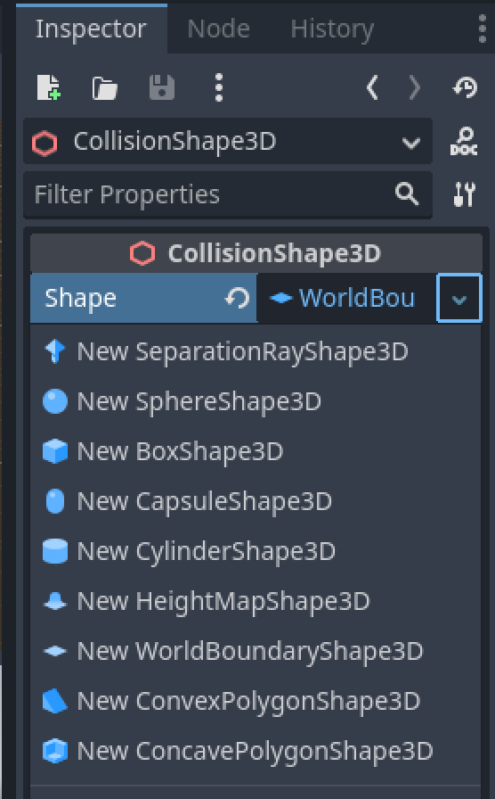

---

## Physics material

Every static/rigid body has a physics material.

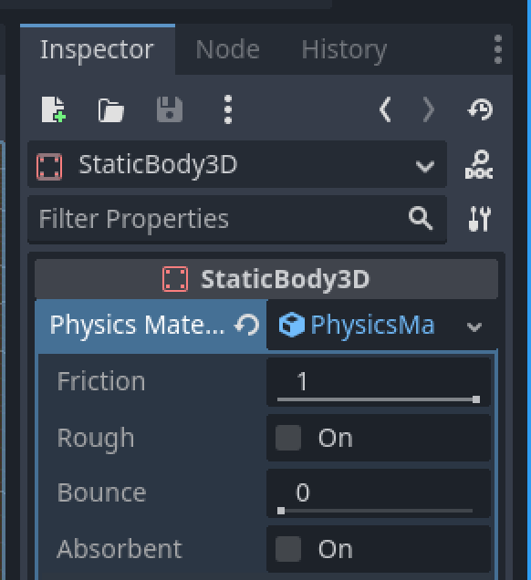

* Friction: Applies when other bodies "slide" over it.
* Bounce: How much force is negated when it collides (Gummibäueli = high value)

---

# Exercise 2 - Add physics to your scene!

---

## Add a `StaticBody3D` to your Floor

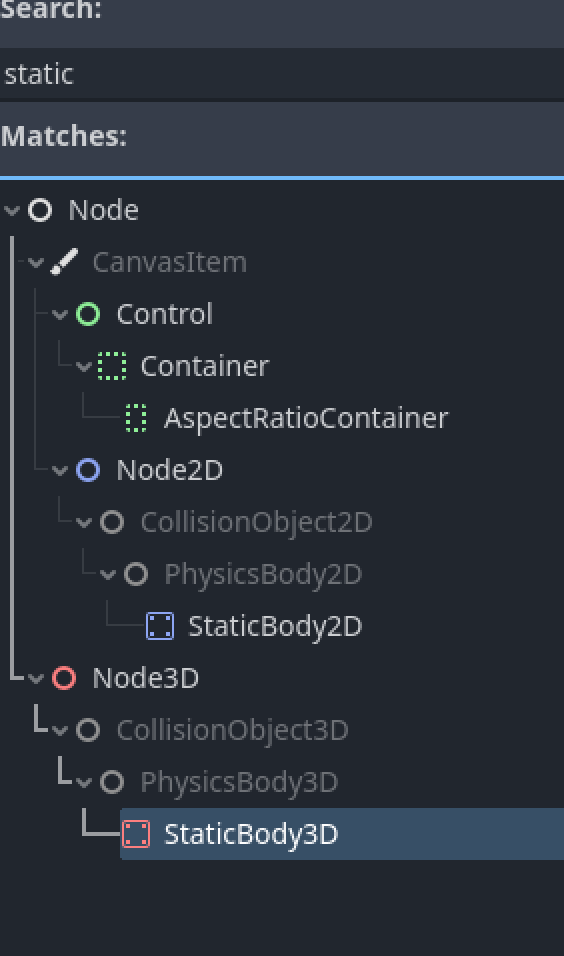

---

## Set a physics material to your `StaticBody3D`

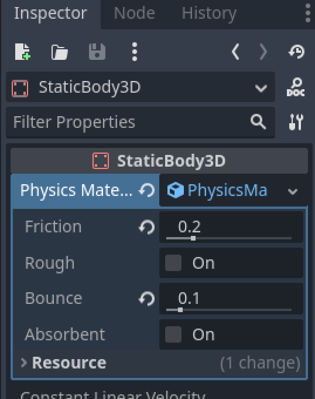

---

## Add a `CollisionShape3D` to your `StaticBody3D`

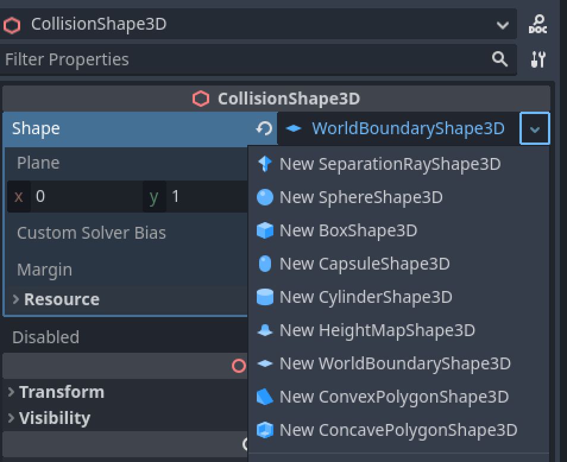

* Select a `WorldBoundaryShape3D` as shape

---

## Make your `can` as its own scene

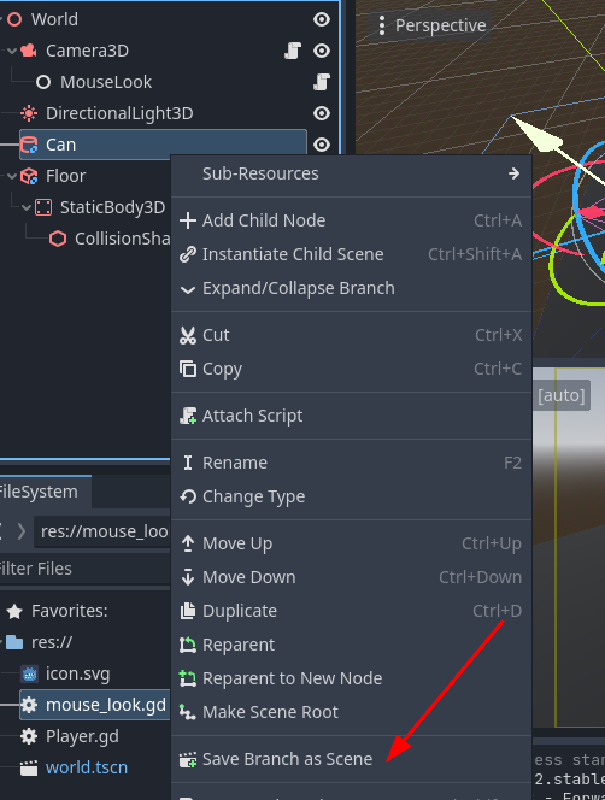

---

## Edit your `can`

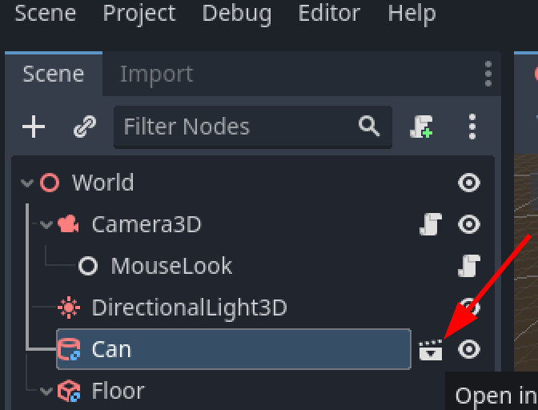

---

## Add a `RigidBody3D`

* Add `RigidBody3D`, make the `RigidBody3D` the root
* Set a weight: 0.2kg
* Set a Physics Material
* Add a `CollisionShape3D`
* Shape: `CylinderShape3D`

Make sure the size matches your `can`!

---

## Make your scene more interesting

* Duplicate your `can`

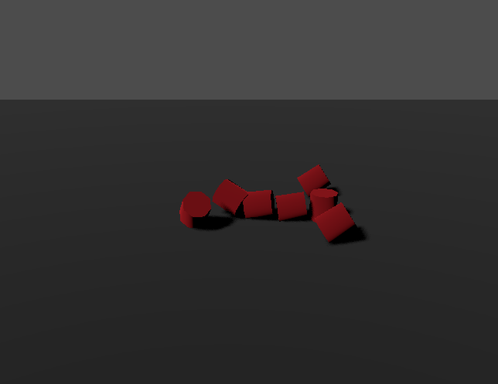

---

## Enjoy your physics sandbox!

---

# GDScript

How actual programming works in Godot

---

## GDScript

Inspired by python, but isn't python.

---

## Basic syntax

```gdscript
# This is a comment

func isEven(number):
    return number % 2 == 0

func isOdd(number: int):
   return number % 2 == 1

# Function that does nothing
func noOp:
    pass

func helloWorld():
    var n : int = 42
    var f : float = 42.42
    var message : String = "Hello World"
    var b : bool = true
    print(n,f,s,b)
```

More:

[[GDScript Basics]](https://docs.godotengine.org/en/stable/tutorials/scripting/gdscript/gdscript_basics.html)

---

## Formatted strings

```gdscript
func formatted():
    var firstName = "John"
    var lastName = "Smith"
    
    # Array
    print("Hello %s %s" % [firstName, lastName])
    
    # Dictionary
    print("Hello {f} {l}" % {"f": firstName, "l": lastName})
```

[[Format specifiers]](https://docs.godotengine.org/en/stable/tutorials/scripting/gdscript/gdscript_format_string.html#format-specifiers)

---

## Good to know classes

* `Vector2` / `Vector3`
* `Color`

---

## Arrays

```gdscript

var my_lucky_numbers : Array[int] = [1,2,3]

```

---

## Nodes and Scripts

A node in the scene tree can have at maximum a script.

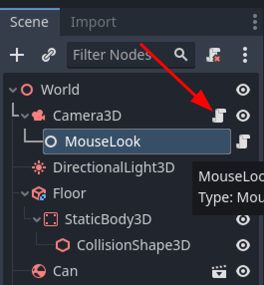

---

## Overridable functions for a `Node`

```gdscript
# Called when both the node and its children have entered the scene tree.
func _ready():
    pass

# Called every frame, as often as possible.
func _process(delta):
    pass

# Called once for every event, before _unhandled_input(), allowing you to
# consume some events.
func _input(event: InputEvent):
    pass
```

[[More]](https://docs.godotengine.org/en/stable/tutorials/scripting/overridable_functions.html#overridable-functions)

---

## Other useful keywords / annotations

* `class_name Foo` makes this class "globally" available, for instancing or type hints. Useful for libraries.
* `@export` makes a variable editable in the editor
* `@onready` statement is run after the script is in the scene tree.

---

# Exercise 4 - Handle user input

---

## Add a script on the camera

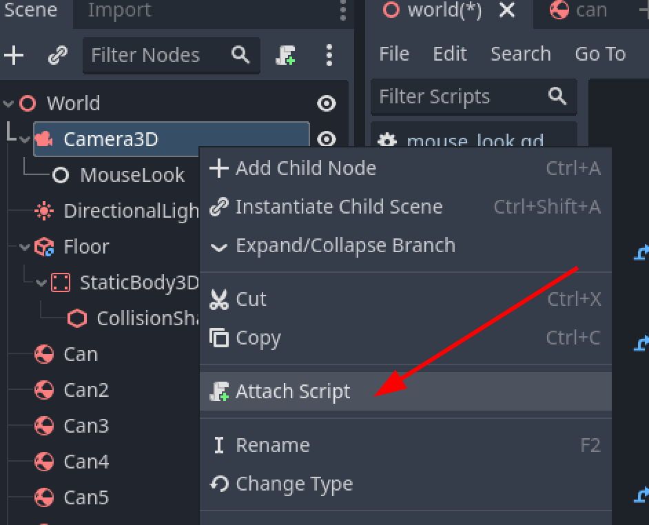

---

## Preload `can.tscn`

Add this snipped:

```gdscript

extends Camera3D

@export
var throwForce : float = 10

const canScene = preload("res://can.tscn") as PackedScene

func _input(event):
	if event is InputEventMouseButton:
		var mouseEvent = event as InputEventMouseButton
		if mouseEvent.button_index == MOUSE_BUTTON_LEFT and mouseEvent.is_pressed():
			# Make an instance of the can
			var instance = canScene.instantiate()
			$"..".add_child(instance)

			# Move the can to the position of the camera
			instance.transform = transform

			# Throw in the look direction
			# The camera always "looks" behind it's base
			var direction = -self.global_transform.basis.z
			instance.apply_impulse(direction * throwForce)
```

---

## Huh, I'm already done?! Too easy bruh.

Ok so here's some more exercises:

Easy:

* Play with some physics parameters.
* Throw a ball instead of a can.
* Throw a giant ball instead of a can.
* Create some more interesting obstacles and furniture.
* Make your scene more interesting by adding spotlights, omni lights.

---

## Still too easy? Medium difficulty:

Make an actual "game". Learn about collision detection and count how many cans you hit.

* Use `RigidBody3D.contact_monitor` and `RigidBody3D.max_contacts_reported`

---

## Medium difficulty (2)

Make even more interesting physics objects using [joints](https://docs.godotengine.org/en/stable/classes/class_joint3d.html).

---

## Medium difficulty (3)

Sound:

* Add some music to your game using `AudioStreamPlayer`
* Add some sound effects using `AudioStreamPlayer3D`, `AudioListener3D`, when objects hit each other.

---

## Medium difficulty (4)

Learn about [UI](https://docs.godotengine.org/en/stable/tutorials/ui/index.html).

---

## Medium difficulty (5)

Learn Blender and model some cool furniture there to import into Godot.

---

## Hard difficulty

* Make a car simulator using `VehicleBody3D`.
* Make a drone / helicopter simulator using `RigidBody3D`

---

## The end